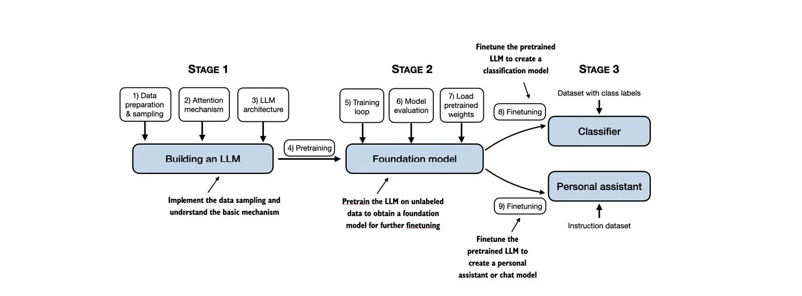

# 🧠 Building a Large Language Model (LLM) from Scratch

<p align="center">
  
</p>

---

## 📘 Overview

This project implements a complete pipeline for **building, training, and fine-tuning a GPT-2 style language model** from scratch using **PyTorch**. It covers all key stages — from data preparation and tokenization to transformer architecture, pretraining, and downstream fine-tuning for tasks like classification.

This implementation is inspired by the book *Build a Large Language Model (from Scratch)* by **Raschka, Mirjalili, and D'Souza (2024)**.

---

## 📂 Project Structure

```
LLM FROM SCRATCH/
├── pycache/
├── gpt2/
├── images/
│   ├── llm.png
│   └── Screenshot 2025-10-21 163332.png
├── llm/
├── sms_spam_collection/
├── .gitattributes
├── .gitignore
├── gpt_download3.py
├── LICENSE
├── LLM.tokenizer.ipynb
├── loss-plot.pdf
├── model_and_optimizer.pth
├── model.pth
├── README.md
├── sms_spam_collection.zip
├── temperature-plot.pdf
├── test.csv
├── the-verdict.txt
├── train.csv
├── validation.csv
└── verdict.txt
```

---

## 🔄 Three-Stage Training Pipeline

The project follows a systematic **three-stage pipeline** to build and deploy a production-ready GPT-2 style model using transfer learning.

### **Stage 1: Building the LLM**

1. **Data Preparation & Sampling**

   * Tokenization of raw text using OpenAI’s `tiktoken` library (GPT-2 BPE encoder).
   * Creation of input-target pairs using a sliding window.
   * Custom PyTorch DataLoader for efficient batching.

2. **Attention Mechanism**

   * Causal multi-head self-attention implementation.
   * Scaled dot-product attention with causal masking.
   * Multiple attention heads capture semantic relationships.

3. **LLM Architecture**

   * Transformer model with embedding layers.
   * Stacked transformer blocks with attention & feed-forward layers.
   * Layer normalization and residual connections for training stability.

---

### **Stage 2: Pretraining the Foundation Model**

4. **Pretraining**

   * Train on *the-verdict.txt* corpus using next-token prediction.
   * Learns language structure, grammar, and semantics.

5. **Training Loop**

   * Implements PyTorch-based optimization and loss calculation.
   * AdamW optimizer with gradient clipping and scheduler.

6. **Model Evaluation**

   * Validation on held-out data for convergence tracking.
   * Checkpointing to save progress.

---

### **Stage 3: Fine-Tuning for Downstream Tasks**

7. **Load Pretrained Weights**

   * Load official GPT-2 (124M) weights automatically via `gpt_download3.py`.

8. **Fine-Tuning for Classification**

   * Train on **SMS Spam Collection** dataset for spam detection.
   * Replace LM head with a classification head.
   * Freeze most transformer layers for efficient adaptation.

9. **Fine-Tuning for Chat Tasks**

   * Adaptation for conversational datasets (instruction-following).
   * Model learns context retention and response generation.

---

## 🧱 Model Architecture

GPT-2 Small (124M) Configuration:

| Parameter        | Value |
| ---------------- | ----- |
| `vocab_size`     | 50257 |
| `context_length` | 1024  |
| `emb_dim`        | 768   |
| `n_heads`        | 12    |
| `n_layers`       | 12    |
| `drop_rate`      | 0.1   |
| `qkv_bias`       | False |

### **Core Components**

* **Token & Position Embeddings:** Map tokens and sequence positions to dense vectors.
* **Transformer Blocks:** Multi-head self-attention + MLP layers with GELU activation.
* **Residuals & LayerNorm:** Ensure gradient stability and fast convergence.

---

## 📈 Results and Performance

### **Pretraining Loss**

* Training loss decreases from ~9.5 → <1.0 in 10 epochs.
* Validation loss stabilizes around 6.5.
* Clear convergence after epoch 6.

### **Fine-Tuning Performance**

| Metric              | Value     |
| ------------------- | --------- |
| Training Accuracy   | **100%**  |
| Validation Accuracy | **97.5%** |

### **Text Generation with Temperature Control**

* Supports *temperature scaling* and *top-k sampling* for output control.

---

## ⚙️ Usage

### **Environment Setup**

```bash
pip install torch tiktoken pandas matplotlib tensorflow tqdm
```

### **Download Pretrained Weights**

```bash
python gpt_download3.py
```

### **Training from Scratch**

```bash
jupyter notebook LLM.tokenizer.ipynb
```

Covers:

* Data preparation & tokenization
* Model architecture implementation
* Pretraining
* Fine-tuning for spam detection
* Text generation

### **Fine-Tuning for Custom Tasks**

```python
# Load pretrained model
model = GPTModel(GPT_CONFIG_124M)
model.load_state_dict(torch.load('model.pth'))

# Add custom classification head
num_classes = your_num_classes
model.out_head = torch.nn.Linear(
    in_features=GPT_CONFIG_124M["emb_dim"],
    out_features=num_classes
)

# Fine-tune on your dataset
train_classifier(model, your_train_loader, your_val_loader)
```

---

## 🌟 Key Features

* ✅ Complete Implementation from Scratch
* 🧩 Modular & Extensible Design
* 🔄 Pretrained Weight Compatibility
* 🧠 Multi-Task Fine-Tuning
* ⚡ Parameter-Efficient Training
* ✨ Flexible Text Generation
* 🧑‍💻 Production-Ready Code

---

## 🧮 Technical Highlights

| Component                 | Description                           | Benefit                           |
| ------------------------- | ------------------------------------- | --------------------------------- |
| **Attention Mechanism**   | Causal masking + multi-head attention | Enables autoregressive generation |
| **Training Optimization** | AdamW + learning rate scheduling      | Stable convergence                |
| **Memory Efficiency**     | Batch processing + gradient clipping  | Handles large batches safely      |

---

## 🚀 Future Enhancements

* GPT-2 Medium / Large / XL Variants
* Multi-GPU Distributed Training
* Advanced Decoding (Nucleus, Beam Search)
* Integration with Instruction-Tuning Datasets
* RLHF Pipeline (Reinforcement Learning from Human Feedback)
* Model Quantization for Lightweight Deployment

---

## 📚 References

* Raschka, S., Mirjalili, V., & D'Souza, D. (2024). *Build a Large Language Model (from Scratch)*. Manning.
* Vaswani, A., et al. (2017). *Attention Is All You Need.*
* Radford, A., et al. (2019). *Language Models are Unsupervised Multitask Learners.*
* SMS Spam Collection Dataset Contributors.

---

## 🪪 License

This project is licensed under the terms specified in the `LICENSE` file.

---

## 🙌 Acknowledgments

* OpenAI — GPT-2 architecture and pretrained weights
* Sebastian Raschka — Educational materials and guidance
* PyTorch Team — Deep learning framework
* SMS Spam Collection Dataset Contributors
